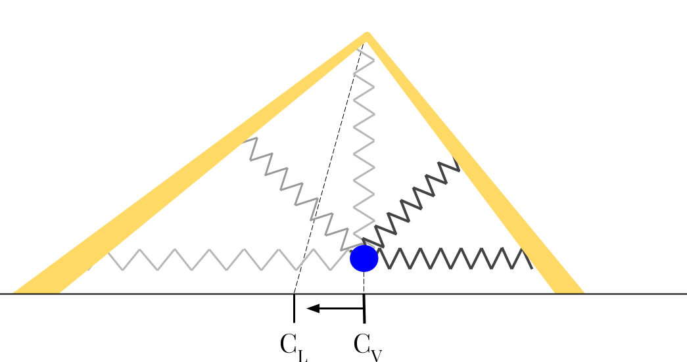

# Route-Blob



## Summary

Lane detection and centering is combined into a single algorithm designed specifically for centering a robot between two visible lines. It leverages OpenCV to do the processing on a color image.

The algorithm begins by running one of a few methods of edge detection on the image, which are interchangeable at run-time. These include Canny edge detection (grayscale or color), adaptive threshold, and the Sobel operator. Most of the time the Canny (color) method is used.

Next, a Hough transform is run on the edges to detect lines. Only lines within forty-five degrees of vertical are accepted. This is done to avoid detecting horizontal edges from stop lines and zebra-stripes. These lines are then extended and drawn on their own image for the final "blob" processing.

Finally, a point CV (see Figure 5) is chosen to be just above the center of the front bumper. Twenty to one-hundred probe lines are sent out in a fan at even intervals between left and right above horizontal. When these probes find a pixel that has been filled by a Hough line, the distance and angle are recorded. If a probe does not find a line, the edge of the image is used. Each probe is then modeled as a spring to push or pull on the initial point toward the center of the lane CL. The horizontal component of this force is used as steering input for the vehicle. The nominal distance and force of the modeled springs is tuned for the vehicle.

## Required ROS Params

`~input` name of camera topic this node subscribes to

## Other ROS Params

`~enable_drive` enables the vehicle to drive using the blob output

`~enable_forward` enables the vehicle to try to always progress forward

`~drive_speed` sets blob output drive speed

`~edge_method`

`~canny_lower_thresh` canny lower threshold value

`~canny_upper_thresh` canny upper threshold value

`~canny_aperture_size`

`~adap_use_gauss`

`~adap_block_size`

`~adap_c`

`~lapla_ksize`

`~sobel_xorder`

`~sobel_yorder`

`~sobel_ksize`

`~enhance_blur`

`~blob_y`

`~blob_x`

`~blob_coeff`

`~blob_len`

`~blob_num_points`

`~blob_median_blur_size`

`~blob_dilation_size`

`~blob_mult`

`~blob_max_p_y`

`~lines_enable` enables blob to check for lines in the image

`~lines_thresh`

`~lines_rho`

`~lines_min_len` sets minimum length of the lines

`~lines_max_gap`

`~lines_top`

`~lines_min_slope` sets the lines minimum slope

`~show_edge_detect` show edges in debug ros topic

`~show_result` display resulting vector in debug ros topic

`~show_blob` display blob in debug ros topic

`~show_lines` display lines in debug ros topic

## Example Launch File

```xml
<launch>
  <node pkg="ltu_actor_route_blob" type="blob" name="blob">
    <param name="input" type="string" value="/camera/image_raw" />
    <param name="enable_drive" type="bool" value="true" />
    <param name="enable_forward" type="bool" value="true" />
    <param name="drive_speed" type="double" value="1.5" />
    <param name="edge_method" type="int" value="0" />
    <param name="canny_lower_thresh" type="int" value="700" />
    <param name="canny_upper_thresh" type="int" value="2000" />
    <param name="canny_aperture_size" type="int" value="2" />
    <param name="adap_use_gauss" type="bool" value="false" />
    <param name="adap_block_size" type="int" value="1" />
    <param name="adap_c" type="double" value="0" />
    <param name="lapla_ksize" type="int" value="1" />
    <param name="sobel_xorder" type="int" value="1" />
    <param name="sobel_yorder" type="int" value="1" />
    <param name="sobel_ksize" type="int" value="1" />
    <param name="enhance_blur" type="int" value="4" />
    <param name="blob_y" type="double" value="0.95" />
    <param name="blob_x" type="double" value="0.5" />
    <param name="blob_coeff" type="double" value="0.1" />
    <param name="blob_len" type="double" value="0.2" />
    <param name="blob_num_points" type="int" value="50" />
    <param name="blob_median_blur_size" type="int" value="13" />
    <param name="blob_dilation_size" type="int" value="5" />
    <param name="blob_mult" type="double" value="3.0" />
    <param name="blob_max_p_y" type="double" value="0.7" />
    <param name="lines_enable" type="bool" value="false" />
    <param name="lines_thresh" type="int" value="40" />
    <param name="lines_rho" type="int" value="1" />
    <param name="lines_min_len" type="int" value="30" />
    <param name="lines_max_gap" type="int" value="10" />
    <param name="lines_top" type="double" value="0.2" />
    <param name="lines_min_slope" type="double" value="0.2" />
    <param name="show_edge_detect" type="bool" value="false" />
    <param name="show_result" type="bool" value="false" />
    <param name="show_blob" type="bool" value="false" />
    <param name="show_lines" type="bool" value="false" />
  </node>
</launch>
```
